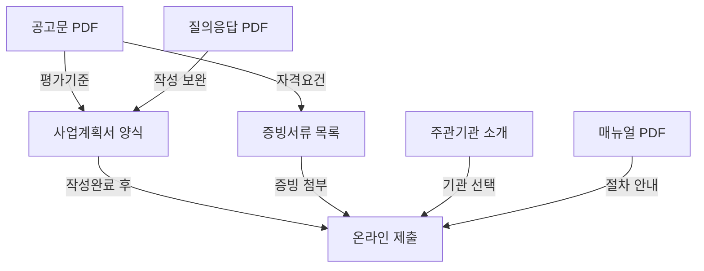

# 서류 자동 분류 테스트 결과

## 분석 대상
- **폴더**: `tests/v1-data/`
- **파일 수**: 9개
- **분석일**: 2025-02-12

---

## 1. 파일 분류 결과

### 분류 체계
```
역할(role)     : 공고문 | 양식 | 참고자료
문서유형(type) : PDF | HWP | DOCX
필수도(priority): 필수 | 선택 | 참고
용도(purpose)  : 심사기준 | 작성대상 | 제출증빙 | 절차안내 | FAQ
```

### 분류 테이블

| # | 파일명 | 역할 | 유형 | 필수도 | 용도 | 크기 |
|---|--------|------|------|--------|------|------|
| 1 | [공고문] 2025년도 창업도약패키지(일반형) 창업기업 모집 수정공고.pdf | **공고문** | PDF | **필수** | 심사기준 | 1.0MB |
| 2 | [별첨 1] 2025년도 창업도약패키지(일반형) 창업기업 사업계획서 양식.hwp | **양식** | HWP | **필수** | 작성대상 | 69KB |
| 3 | [별첨 1] 2025년도 창업도약패키지(일반형) 창업기업 사업계획서 양식.docx | **양식** | DOCX | **필수** | 작성대상 | 45KB |
| 4 | [별첨 2] 2025년도 창업도약패키지(일반형) 창업기업 사업계획서 증빙서류 제출목록 양식.hwp | **양식** | HWP | **필수** | 제출증빙 | 87KB |
| 5 | [별첨 2] 2025년도 창업도약패키지(일반형) 창업기업 사업계획서 증빙서류 제출목록 양식.docx | **양식** | DOCX | **필수** | 제출증빙 | 64KB |
| 6 | [별첨 3] 2025년도 창업도약패키지(일반형) 주관기관 소개자료.pdf | **참고자료** | PDF | 선택 | 기관정보 | 1.1MB |
| 7 | [참고 1] 온라인 사업신청 매뉴얼(일반형).pdf | **참고자료** | PDF | 참고 | 절차안내 | 1.3MB |
| 8 | [참고 2] K-Startup 회원가입 및 정보등록 매뉴얼.pdf | **참고자료** | PDF | 참고 | 절차안내 | 2.6MB |
| 9 | [참고 3] 2025년도 창업도약패키지(일반형) 창업기업 모집 공고 주요 질의응답.pdf | **참고자료** | PDF | 참고 | FAQ | 2.0MB |

---

## 2. 자동 분류 규칙 (패턴 기반)

### 파일명 패턴 → 역할 매핑
```python
CLASSIFICATION_RULES = {
    r'\[공고문\]': {
        'role': 'announcement',
        'priority': 'required',
        'purpose': 'evaluation_criteria'
    },
    r'\[별첨\s*\d+\].*양식': {
        'role': 'template',
        'priority': 'required',
        'purpose': 'submission_target'
    },
    r'\[별첨\s*\d+\].*소개': {
        'role': 'reference',
        'priority': 'optional',
        'purpose': 'institution_info'
    },
    r'\[참고\s*\d+\].*매뉴얼': {
        'role': 'reference',
        'priority': 'reference',
        'purpose': 'procedure_guide'
    },
    r'\[참고\s*\d+\].*질의응답': {
        'role': 'reference',
        'priority': 'reference',
        'purpose': 'faq'
    }
}
```

### 중복 파일 감지
- `[별첨 1] 사업계획서 양식`: HWP + DOCX 동일 내용 (DOCX 우선 처리 권장)
- `[별첨 2] 증빙서류 제출목록 양식`: HWP + DOCX 동일 내용 (DOCX 우선 처리 권장)

---

## 3. Context 구조 (사업계획서 작성 시 참조 순서)

### AI 사업계획서 작성 시 문서 활용 우선순위

```
[1순위] 공고문 PDF
  └─ 평가항목/배점표 추출 → 작성 방향 결정
  └─ 신청자격/제외대상 → 자격 사전 확인
  └─ 사업 개요/지원내용 → 사업 맥락 파악

[2순위] 사업계획서 양식 (별첨 1)
  └─ 목차/섹션 구조 → 작성 프레임워크
  └─ 표 양식 → 입력 필드 파악
  └─ 작성 가이드 → 각 항목별 요구사항

[3순위] 증빙서류 목록 (별첨 2)
  └─ 필수 증빙 → 체크리스트
  └─ 가점 증빙 → 보너스 포인트 확인
  └─ 동의서 양식 → 공동대표 시 필요

[4순위] 질의응답 (참고 3)
  └─ FAQ → 작성 시 주의사항 보완
  └─ 사업비 규정 → 예산 작성 가이드

[5순위] 주관기관 소개 (별첨 3)
  └─ 주관기관별 프로그램 → 선택 참고

[참고] 매뉴얼 (참고 1, 2)
  └─ 온라인 접수 절차 → 최종 제출 시 참조
```

---

## 4. 핵심 문서 의존 관계



---

## 5. 평가항목 ↔ 사업계획서 섹션 매핑

| 평가항목 | 배점 영역 | 사업계획서 섹션 | 핵심 작성 포인트 |
|--------|---------|-------------|---------------|
| **문제인식** | Problem | 1. 창업아이템 개발 동기(필요성) 및 현황 | 시장 Pain Point, 기존 솔루션 한계, 개발 배경 |
| **실현가능성** | Solution | 2-1. 목표시장(고객) 분석 / 2-2. 사업화 추진 성과 | TAM/SAM/SOM, 시장 진입 실적, 매출 데이터 |
| **성장전략** | Scale-up | 3-1. 사업화 추진 전략 / 3-2. 자금운용 계획 | Go-to-Market, 매출 추정, 사업비 산출근거 |
| **팀(기업) 구성** | Team | 4-1. 기업구성 및 역량 / 4-2. 인프라 활용 | 대표자 경력, 핵심인력, 장비·시설, 특허 |

---

## 6. 증빙서류 체크리스트

### 필수 제출
- [ ] ① 대표자(신청자) 신분증 사본 (주민등록증/운전면허증/여권)
- [ ] ② 사업자등록증 또는 사업자등록증명원

### 해당 시 제출
- [ ] ③ 공동대표/각자대표 신분증 및 동의서 (대표자 1인 초과 시)
- [ ] 최근 1년 이내 5억원 이상 투자유치 증빙 (가점 1점)
- [ ] 성실경영 심층평가 통과 확인증 (서류평가 면제)
- [ ] 기타 증빙 (특허, 아이템도면, 투자계약, 수출계약 등)

---

## 7. 주관기관 핵심 정보 (별첨 3 요약)

| 기관명 | 전문분야 | 선정규모 | 특화 프로그램 |
|--------|---------|--------|------------|
| 경남창조경제혁신센터 | 스마트기계, 선박, 해양, 신재생에너지, 우주항공 | 22개사 | G-Start Up, 글로벌 쇼케이스, 대·스타 |
| 경북대학교 창업지원단 | ICT(AI·빅데이터 등) | 26개사 | K-스케일업데이, Open Global Road, V.I.P |
| 광주정보문화산업진흥원 | 인공지능, ICT·SW, 콘텐츠, 산업융합 | 33개사 | 투자 미다스, 글로벌 콜럼버스, 특화 알파고 |
| 부천산업진흥원 | 정보·통신, 전기·전자, 기계·소재 | 27개사 | IR 투자미팅, 글로벌진출, Impact Grow |
| 서원대학교 산학협력단 | 바이오, 스마트IT, AI·SaaS | 37개사 | 투자매치메이킹, 글로벌비즈온, 바이오스케일업 |
| 울산경제일자리진흥원 | 기계소재, 화공섬유, 에너지자원 | 19개사 | 투자 Scale-Up, 글로벌 도약, ESG전환 |
| 인천테크노파크 | 정보통신·SW, 바이오·헬스케어, 첨단제조·로봇 | 30개사 | 후속투자, 글로벌시장확대, 컨설팅, 대기업 오픈이노베이션 |
| 한국보건산업진흥원 | 바이오·의료·생명, 인공지능, 빅데이터 | 20개사 | 투자유치 스케일업, 글로벌 스케일업, 기술 고도화 |
| 한국수자원공사(K-water) | 정보·통신, 기계·소재, 에너지·자원 | 20개사 | IR Linkup, Global Wave, 공공 Bridge, K-테스트베드 |
| 한국탄소산업진흥원 | 기계소재, 전기전자, 에너지자원 | 19개사 | 글로벌진출, 투자, 네트워킹, ESG경영, 기관특화 |

---

## 8. FAQ 핵심 요약 (참고 3에서 추출)

### 사업 신청
- 온라인만 가능 (K-Startup), 우편/방문 불가
- 반드시 대표자 본인 ID로 신청
- 주관기관 1개만 선택 가능, 마감 후 변경 불가
- 사업장 소재지/거주지와 무관하게 주관기관 선택 가능

### 사업계획서
- HWP 또는 DOCX 모두 제출 가능 (PDF 자동변환)
- **양식 변경 불가** (목차, 세부항목 임의 변경/삭제 시 평가 제외)
- 20쪽 내외 작성, 30MB 이내
- 이미지(사진, 표, 그래프) 삽입 가능

### 사업비
- 인건비: 전년도 근로소득 기준으로 계상
- 대표자 인건비: 현물로만 계상 (사업비 지급 불가)
- 대표자 가족 인건비: 불가
- 사무 가구/집기: 불가 (시제품 재료비는 가능)
- 제품 광고비: 가능 (홈페이지, 홍보물, 온라인 쇼핑몰 입점비 등)

### 평가·선정
- 서류평가 후 발표평가 준비기간: 약 7일
- 접수 마감 이후 사업계획서 수정 불가
- 과거 탈락 이력은 재신청에 영향 없음
- 과거 선정·지원 받은 기업은 재신청 불가
